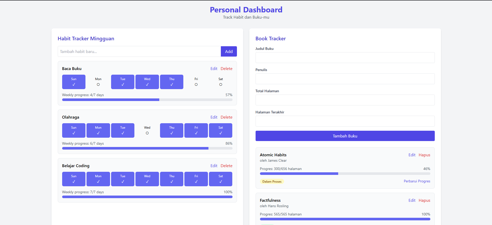

# Personal Dashboard - Habit Tracker & Book Tracker

Aplikasi web sederhana untuk melacak habit mingguan dan progres membaca buku. Aplikasi ini dibuat menggunakan HTML, CSS (Tailwind), dan JavaScript ES6+.

## Fitur Utama

### Habit Tracker
- Menambahkan Habit yang ingin dilacak
- Melacak habit per hari dalam seminggu (dengan sistem checkbox)
- Melihat progres mingguan untuk setiap habit
- Mengedit atau menghapus habit

### Book Tracker
- Menambahkan buku yang sedang dibaca
- Melacak progres membaca (halaman saat ini dan total halaman)
- Melihat persentase penyelesaian buku
- Mengupdate progres, mengedit, atau menghapus buku

## Screenshot Aplikasi



## Fitur ES6+ yang Diimplementasikan

1. **Deklarasi Variabel dengan `let` dan `const`**
   - `const` digunakan untuk nilai yang tidak berubah seperti konstanta, elemen DOM, dan fungsi
   - `let` digunakan untuk variabel yang nilainya dapat berubah

2. **Arrow Functions**
   - Implementasi pada fungsi debounce di utils.js
   - Callback functions pada event listeners
   - Fungsi map untuk rendering komponen

3. **Template Literals**
   - Digunakan di seluruh aplikasi untuk rendering HTML dinamis
   - Contoh: ``` `<h3 class="font-medium">${habit.title}</h3>` ```

4. **Classes dan OOP**
   - Class `Habit` dan `Book` untuk model data
   - Class `DataManager` untuk mengelola penyimpanan data
   - Class `HabitTracker` dan `BookTracker` untuk logika UI

5. **Modules (import/export)**
   - Struktur kode modular dengan ES6 modules
   - Export/import fungsi dan class antar file

6. **Async/Await**
   - Implementasi pada fungsi `init()` di main.js
   - Penanganan error dengan try/catch

7. **LocalStorage API**
   - Penggunaan localStorage untuk menyimpan data pengguna
   - Data tersimpan secara lokal bahkan setelah browser ditutup

8. **Spread/Rest Operator**
   - Digunakan dalam fungsi debounce untuk meneruskan argumen

9. **Destructuring Assignment**
   - Ekstraksi nilai dari objek dan array dengan cara yang ringkas

## Struktur Proyek

```
project-js-nextgen/
├── index.html          # File HTML utama
├── css/
│   └── style.css       # Custom CSS (tambahan dari Tailwind)
├── image/
├── js/
│   ├── main.js         # Entry point aplikasi
│   ├── app.js          # Komponen utama aplikasi
│   ├── modules/
│   │   ├── utils.js    # Fungsi utility
│   │   └── data.js     # Manajemen data dan localStorage
```

## Cara Menjalankan

1. Clone repository atau download file zip
2. Buka file `index.html` di browser
3. Mulai gunakan aplikasi untuk melacak habit dan progres membaca buku

## Teknologi yang Digunakan

- HTML5
- CSS (Tailwind CSS via CDN)
- JavaScript ES6+
- LocalStorage API